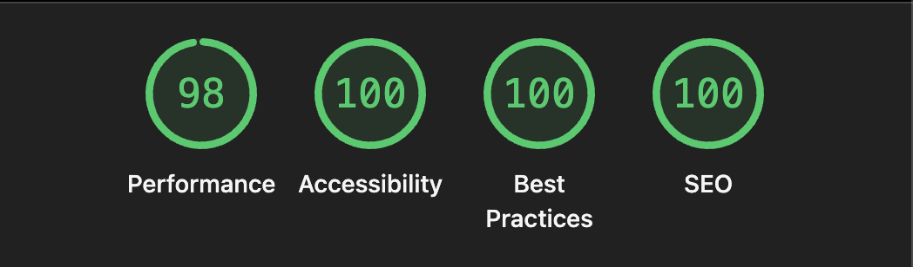
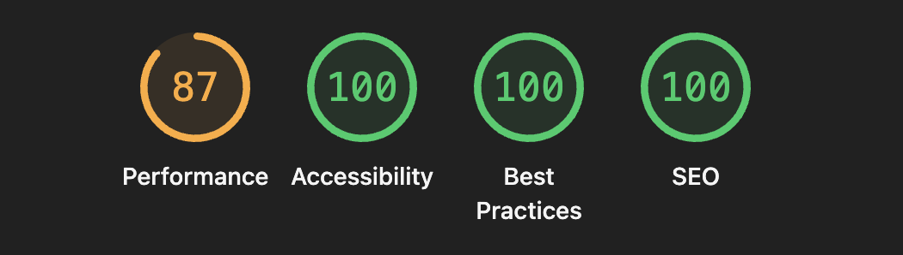
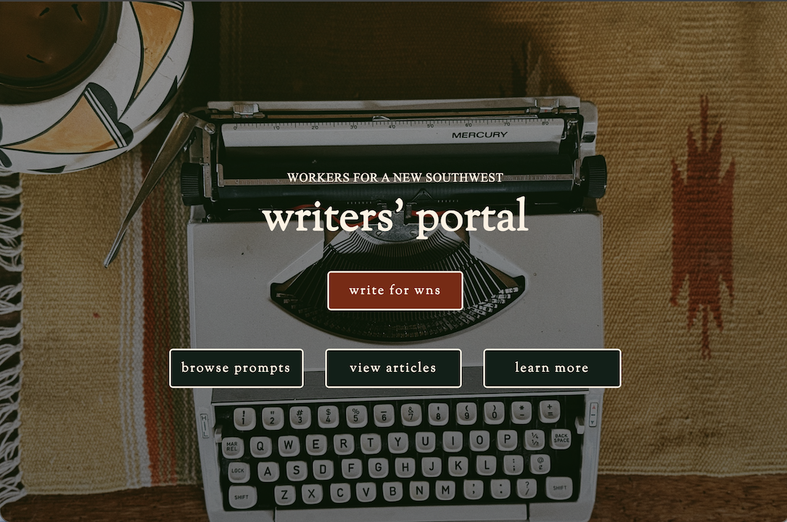

# WNS-writers-portal (May 2026)

**_View this project:_** [https://wns-writers-portal.netlify.app/](https://wns-writers-portal.netlify.app/)

## Description

Coded in HTML, JavaScript, and CSS, this website constitutes the Writers' Portal for Workers for a New Southwest (WNS). The Writers' Portal is where prospective writers from the WNS general community can learn more, browse prompts, and view published articles from WNS's Substack. The design is original, accessible, and fully responsive across mobile devices, tablets, and desktops. It features embedded content on the Articles page in addition to content dynamically injected and conditionally rendered via vanilla JavaScript on the Prompts page. This website was coded _pro bono_ from scratch to support a strong culture of writing, critical reflection, and human development. It represents an experiment in digital humanism, in leveraging technology creatively and ethically in close collaboration with community in service of social uplift.

WNS (pronounced "wins") is a grassroots organization based in Albuquerque, New Mexico. To find out more, visit WNS's Instagram account here: [https://www.instagram.com/workersforanewsouthwest/?hl=en](https://www.instagram.com/workersforanewsouthwest/?hl=en).

## Accessibility

This website was designed conscientiously with digital accessibility in mind for those with visual, auditory, motor, and/or cognitive disabilities or sensory impairments. Every effort was made to use best practices where feasible.

Ratings by Lighthouse Audit:

- Desktop:
  
- Mobile
  

## Permissions

I am offering my code and original design as an open-source resource for the community. However, the textual content, image(s) in the _assets_ directory, and data in the _data_ directory belong to the organization Workers for a New Southwest. Therefore, if you reuse my code, be sure not to appropriate their content, images, logo, or data. Thank you.

## License

MIT License

Copyright (c) 2026 Addy López

## Project Preview

